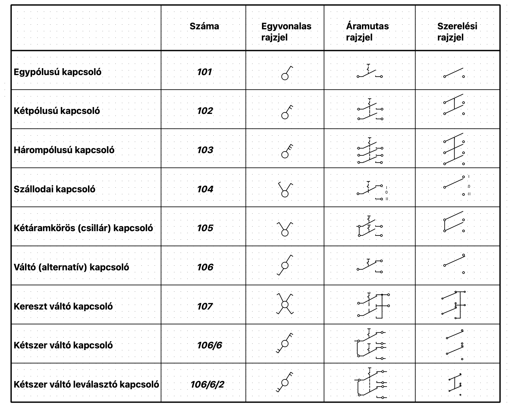

# QElectroTech Elements

A projekt célja, hogy a QElectroTech alkalmazással készült szimbólumokat (magyar elnevezéssel) tárolja.
Kategorizáltan elkészült vektorgrafikus objektumok szabadon letölthetők, módosíthatók és terjeszthetők.

- Egyvonalas rajzjelek
- Áramutas rajzjelek
- Szerelési rajzjelek
- Vezérléshez használt rajzjelek

## Rajzjelek telepítése

Valamennyi operációs rendszer alatt (Windows, Linux, MacOS) hasonlóan lehet beállítani a felhasználói gyújtemény helyét.
Töltsük le a rajzjeleket egy előre kijelölt könyvtárba, majd az alkalamzás alatt keressük meg a beállításokat/általános/gyűjtemény 
helyet és állítsuk be ezt a kijelölt könyvtárat a felhasználói gyűjtemény helyének.

## Kapcsolók rajzjelei
Elkészült valamennyi kapcsoló típus egyvonal, áramutas és szerelési rajzjele érintkezőkkel együtt.

